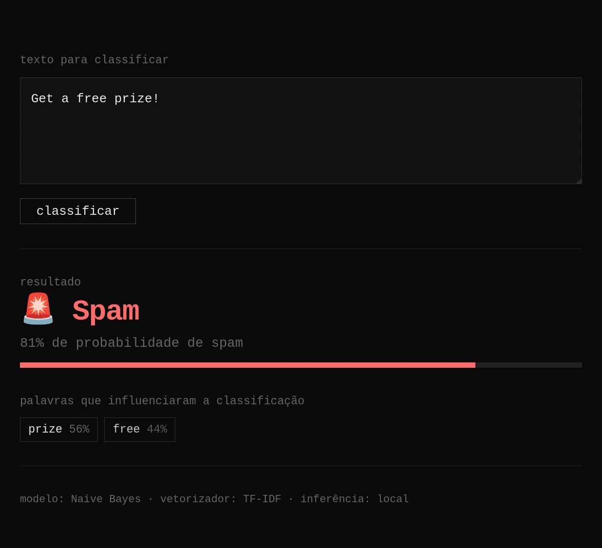

# Classificador de Spam

Interface web local que classifica mensagens de texto como spam ou legítimas
usando um modelo Naive Bayes treinado com o conjunto de dados SMS Spam Collection.

Além do resultado, a página exibe quais palavras mais influenciaram a classificação
e o peso relativo de cada uma.



---

## Requisitos

- **Python 3.9+** ([download](https://www.python.org/downloads/))

Para verificar se o Python está instalado:

```bash
python3 --version
```

No Windows, use `python --version`.

---

## Como usar

### 1. Clone o repositório

```bash
git clone https://github.com/MigueleugiM26/spam-classifier.git
cd spam-classifier
```

### 2. Crie um ambiente virtual (recomendado)

**Linux / macOS:**

```bash
python3 -m venv .venv
source .venv/bin/activate
```

**Windows (PowerShell):**

```powershell
python -m venv .venv
.venv\Scripts\Activate.ps1
```

**Windows (cmd):**

```cmd
python -m venv .venv
.venv\Scripts\activate.bat
```

### 3. Instale as dependências

```bash
pip install -r requirements.txt
```

### 4. Rode o servidor

```bash
python app.py
```

Você verá algo assim:

```
Classificador de Spam
Servidor rodando em http://localhost:8000
Pressione Ctrl+C para encerrar.
```

O navegador abrirá automaticamente em `http://localhost:8000`. Se não abrir,
acesse manualmente.

Para encerrar, pressione `Ctrl+C` no terminal.

---

## Alternativa: modo linha de comando

Classificação rápida direto no terminal, sem interface gráfica:

```bash
# Modo interativo
python main.py

# Texto direto como argumento
python main.py "Free prize winner click here now!!!"
```

Saída de exemplo:

```
🚨 SPAM (82.0% de probabilidade de spam)
```

---

## Estrutura do projeto

```
spam-classifier/
├── app.py                  # Backend Flask (serve a página + API /classificar)
├── main.py                 # Alternativa CLI
├── index.html              # Interface web
├── requirements.txt
├── model/
│   ├── spam_model.pkl      # Modelo Naive Bayes treinado
│   └── vectorizer.pkl      # Vetorizador TF-IDF
├── data/                   # CSV usado no treinamento
└── notebooks/              # Notebooks de exploração e treino
```

---

## Como funciona

1. O navegador carrega `index.html` a partir do servidor Flask local.
2. O usuário cola uma mensagem e clica em classificar.
3. O texto é enviado via `POST` para `http://localhost:8000/classificar`.
4. O Flask vetoriza o texto com o TF-IDF salvo, passa pelo modelo Naive Bayes
   e retorna a probabilidade de spam e as palavras com maior peso na decisão.
5. A página renderiza o resultado com a barra de probabilidade e os gatilhos.

A porta padrão é `8000`. Para usar outra, defina a variável de ambiente `PORT`:

```bash
PORT=9000 python app.py
```

---

## Solução de problemas

**`ModuleNotFoundError: No module named 'flask'`**
→ O ambiente virtual não está ativado, ou as dependências não foram instaladas.
Rode `pip install -r requirements.txt`.

**`FileNotFoundError: Modelo não encontrado`**
→ Verifique se `model/spam_model.pkl` e `model/vectorizer.pkl` existem.

**Porta 8000 já em uso**
→ Rode com `PORT=9000 python app.py`.

**O navegador não abre sozinho**
→ Acesse manualmente `http://localhost:8000`.

---

## Licença

Uso pessoal / educacional. Dataset: [SMS Spam Collection](https://www.kaggle.com/datasets/uciml/sms-spam-collection-dataset) via UCI ML Repository.
